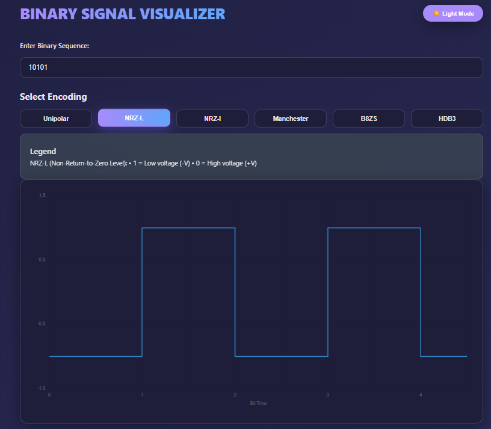
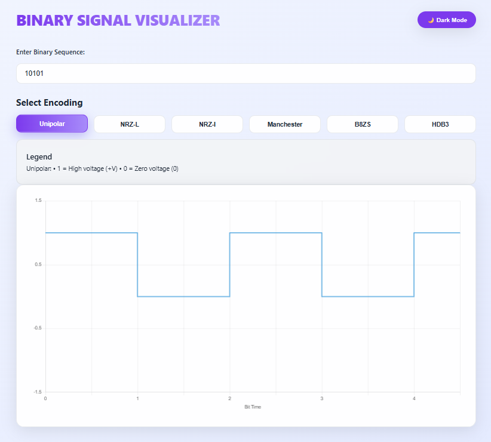

# 📊 Binary Signal Visualizer

> **Visualize how binary data becomes digital signals**  
> A sleek, interactive tool for exploring line encoding techniques in digital communications.

## 🔧 Features

- ✅ **6 Encoding Schemes**: NRZ-L, NRZ-I, Manchester, B8ZS, HDB3, Unipolar
- 🎨 **Modern UI**: Glassmorphism, gradients, smooth animations, and **dark mode**
- 📱 **Fully Responsive**: Works flawlessly on mobile, tablet, and desktop
- 🖥️ **Real-Time Visualization**: Waveform updates instantly as you type
- 🧠 **Educational Legend**: Clear explanation of each encoding method
- 🚀 **Zero Dependencies**: Built with pure HTML, CSS, and JavaScript
- 🔌 **No Setup Needed**: Runs directly in any browser — perfect for offline use

---
## 🚀 Quick Start

### Option 1: Use Online

Simply open the [live demo](https://b17br34k3r.github.io/encoder-decoder/) in your browser and start using the tool immediately.

### Option 2: Run Locally

## 🎯 Supported Encodings

| Encoding       | Use Case                    | Key Feature                                |
| -------------- | --------------------------- | ------------------------------------------ |
| **NRZ-L**      | Simple digital transmission | Level-based: 1 = low, 0 = high             |
| **NRZ-I**      | Magnetic storage            | Transition on `1` only                     |
| **Manchester** | Ethernet (IEEE 802.3)       | Mid-bit transition for clock sync          |
| **Unipolar**   | Basic signaling             | `1` = high, `0` = zero                     |
| **B8ZS**       | T1 lines (North America)    | Replaces 8 zeros with violation pattern    |
| **HDB3**       | E1 lines (Europe)           | Replaces 4 zeros with balancing violations |

---

## 🚀 Try It

git clone https://github.com/b17br34k3r/Binary-Signal-Visualizer.git
open index.html
